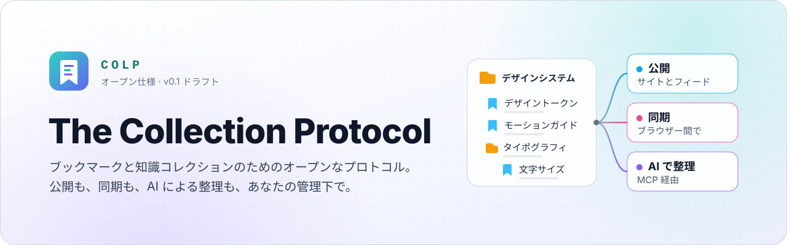
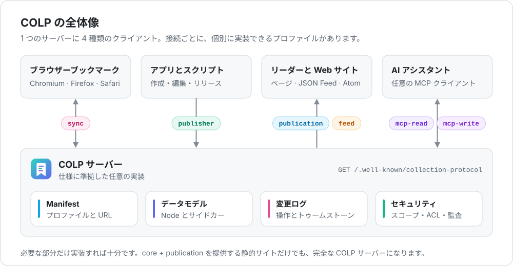
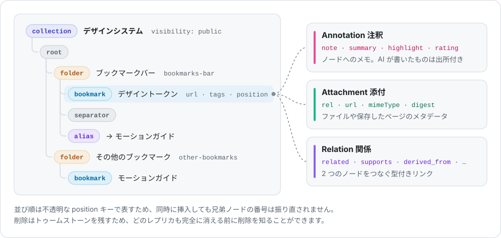
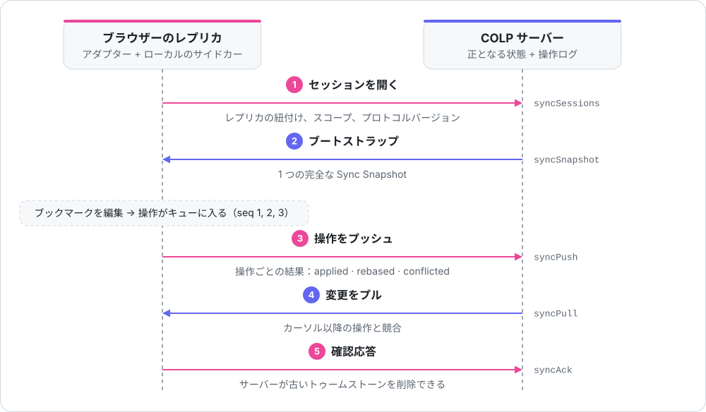
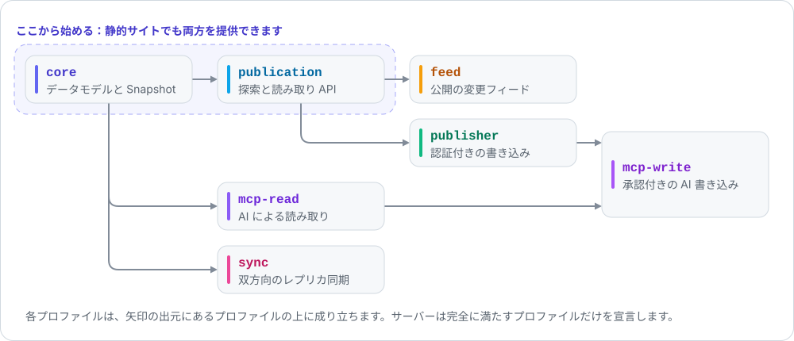

<p align="center">
  <picture>
    <source media="(prefers-color-scheme: dark)" srcset="docs/assets/banner.ja.dark.svg">
    
  </picture>
</p>

<p align="center">
  <a href="README.md">English</a> · <a href="README.zh-CN.md">简体中文</a> · <b>日本語</b>
</p>

<p align="center">
  <a href="https://github.com/WhitenWhiten/colp/actions/workflows/colp-ci.yml"></a>
  <a href="protocol/SPECIFICATION.md"></a>
  <a href="protocol/docs/05-mcp-profile.md"></a>
  <a href="packages/node"></a>
  <a href="LICENSE"></a>
</p>

ブックマークは、人が蓄える知識のなかでも特に個人的なものです。それなのに、ブラウザーはそれぞれ独自の形式で保存し、同期は 1 つのベンダーに縛られ、リストを共有するには HTML をエクスポートするしかなく、AI ツールは安全に扱うことができません。

**The Collection Protocol（COLP）** は、ブックマークとキュレーションされた知識コレクションのための、HTTP ネイティブなオープンプロトコルです。

- **1 つのデータモデル**：ブラウザーのブックマークツリーと知識コレクションを、Chromium、Firefox、Safari、Netscape ブックマーク HTML との間で情報を失わずに表現します。
- **ブログのように公開**：ディスカバリー、スナップショット、JSON Feed、Atom に対応し、HTTP キャッシュを最初から備えています。
- **同期**：ブラウザー、アプリ、サーバーの間を、リビジョン、競合、トゥームストーンを持つ操作ログで同期します。
- **AI の手を借りる**：MCP のリソースとツールを通じて、スコープと監査のもとで利用できます。リスクの高い操作はすべて「計画 → 承認 → コミット」の流れを通ります。
- **デフォルトで非公開**：サーバーへの同期は公開ではありません。トークン、キー、AI への権限付与はすべてスコープで制限されます。

<p align="center">
  <picture>
    <source media="(prefers-color-scheme: dark)" srcset="docs/assets/architecture.ja.dark.svg">
    
  </picture>
</p>

> 仕様本文（[`protocol/`](protocol/README.ja.md)）は英語版が正です。このページは日本語の案内です。

## 目次

- [仕組み](#仕組み)
- [ざっと見てみる](#ざっと見てみる)
- [試してみる](#試してみる)
- [目的別ガイド](#目的別ガイド)
- [リポジトリ構成](#リポジトリ構成)
- [プロジェクトの状況](#プロジェクトの状況)
- [コントリビューション](#コントリビューション)

## 仕組み

ここでは要点だけを紹介します。[5 分でわかる COLP](protocol/README.ja.md#5-分でわかる-colp) ではもう一段詳しく説明し、[用語集（英語）](protocol/GLOSSARY.md) ではすべての用語を解説しています。

### データモデル

<p align="center">
  <picture>
    <source media="(prefers-color-scheme: dark)" srcset="docs/assets/data-model.ja.dark.svg">
    
  </picture>
</p>

**Collection** は **Node**（`root`、`folder`、`bookmark`、`separator`、`alias`）の順序付きツリーで、ブラウザーのブックマークツリーと 1 対 1 に対応します。ブラウザーが保存できないデータは、ツリーの横に **サイドカー** として置きます。注釈（メモ、要約、ハイライト、評価。AI が書いたものには出所情報が付きます）、添付、型付きの関係です。それ以外のデータは名前空間付きの `extensions` に入れ、サーバーはそのまま保持します。詳しくは [01 コアデータモデル](protocol/docs/01-core-data-model.md) を参照してください。

### 双方向同期

<p align="center">
  <picture>
    <source media="(prefers-color-scheme: dark)" srcset="docs/assets/sync-flow.ja.dark.svg">
    
  </picture>
</p>

レプリカ同士がやり取りするのはツリー全体ではなく **操作** です。各操作にはレプリカごとの連番と、作成時に基づいていたリビジョンが付くため、サーバーはそれを適用するか、リベースするか、競合として記録できます。再送されたプッシュが二重に適用されることもありません。削除はトゥームストーンを残し、アクティブなレプリカがすべて確認応答するまで保持されます。詳しくは [03 同期](protocol/docs/03-sync.md) と [06 ブラウザーマッピング](protocol/docs/06-browser-mapping.md) を参照してください。

### プロファイル

<p align="center">
  <picture>
    <source media="(prefers-color-scheme: dark)" srcset="docs/assets/profiles.ja.dark.svg">
    
  </picture>
</p>

COLP は組み合わせ可能な適合プロファイルに分かれています。サーバーは完全に満たすプロファイルだけを Manifest で宣言し、クライアントはそれ以外のすべてを Manifest から見つけます。

| プロファイル | 追加されるもの | 仕様 |
|---|---|---|
| `core` | オブジェクト、厳格な JSON Schema、セマンティック検証、完全な Snapshot | [01](protocol/docs/01-core-data-model.md) |
| `publication` | ディスカバリー、ディレクトリ、メタデータ、ページ分割された Snapshot、ETag、Problem Details | [02](protocol/docs/02-http-publication-feed.md) |
| `feed` | カーソル付きの公開変更ストリーム、JSON Feed、Atom | [02](protocol/docs/02-http-publication-feed.md) |
| `publisher` | `If-Match`、冪等キー、リリースを備えた認証付きの書き込み | [08](protocol/docs/08-write-api.md) |
| `sync` | セッション、プッシュ、プル、確認応答、競合、トゥームストーン | [03](protocol/docs/03-sync.md) |
| `mcp-read` | MCP のリソースと読み取り専用ツール | [05](protocol/docs/05-mcp-profile.md) |
| `mcp-write` | MCP の書き込みツール、スコープ、監査、リスクの高い変更のための計画 / コミット | [05](protocol/docs/05-mcp-profile.md) |

## ざっと見てみる

すべては well-known URL から始まります。Manifest は、サーバーが対応するプロファイルと各エンドポイントの場所をクライアントに伝えるので、クライアントがパスを推測することはありません。

```http
GET /.well-known/collection-protocol HTTP/1.1
Host: alice.example
Accept: application/vnd.collection-protocol.manifest+json
```

```jsonc
{
  "protocol": "https://collectionprotocol.org/spec/0.1",
  "protocolVersions": ["0.1"],
  "serverUuid": "019b3c67-a03c-7f02-9c7e-1ee8d50a77de",
  "title": "Alice's Collections",
  "mounts": [{
    "id": "default",
    "baseUrl": "https://alice.example/collections/",
    "profiles": ["core", "publication", "publisher", "sync", "mcp-read", "mcp-write"],
    "endpoints": {
      "directory": "https://alice.example/collections",
      "collection": "https://alice.example/collections/c/{collectionId}",
      "snapshot": "https://alice.example/collections/c/{collectionId}/snapshot",
      "mcp": "https://alice.example/collections/-/mcp"
      // ……宣言したプロファイルが必要とするすべてのエンドポイント
    }
  }]
}
```

Node.js のリファレンス実装を使うと、クライアントは Manifest をたどり、検証済みの完全な Snapshot を組み立てます。

```ts
import { ColpClient } from '@collection-protocol/node/client';

const client = new ColpClient({
  manifestUrl: 'https://alice.example/.well-known/collection-protocol',
});

const manifest = await client.discover();
const snapshot = await client.getSnapshot('interface-systems');
console.log(manifest.title, snapshot.nodes.length);
```

完全な例は [`protocol/examples/public-manifest.json`](protocol/examples/public-manifest.json) にあります。28 個の例はすべて CI で検証しています。

## 試してみる

Node.js 22 以降が必要です。リポジトリをクローンしたら、リファレンスパッケージをビルドし、サンプルサーバーのセルフテストを実行します。セルフテストは小さな `core + publication` サーバーを起動し、`ColpClient` で Manifest からすべてを読み戻してから終了します。

```bash
git clone https://github.com/WhitenWhiten/colp.git && cd colp
npm run install:package && npm run build
npm run example:publication -- --self-test
```

```text
Manifest:  Example Collections (core, publication)
Directory: 1 collection(s)
Metadata:  Interface Systems
Snapshot:  2 node(s), 1 annotation(s)
```

`curl` で触ってみたい場合は、`--self-test` を付けずに起動し、終わったら Ctrl+C で止めてください。

```bash
npm run example:publication
curl -i http://127.0.0.1:8080/.well-known/collection-protocol
```

このサーバーは `node:http` で作った [1 つのファイル](packages/node/examples/publication-server.mjs) だけでできています。どこがアプリケーションの担当で、どこをパッケージが引き受けるのかがわかります。

## 目的別ガイド

| やりたいこと | 最初に読むもの |
|---|---|
| プロトコルの仕組みを理解する | [5 分でわかる COLP](protocol/README.ja.md#5-分でわかる-colp)、次に [用語集（英語）](protocol/GLOSSARY.md) |
| TypeScript や JavaScript で COLP のデータを読む・検証する | [パッケージの README](packages/node/README.md) と [API ガイド](packages/node/docs/API.md) |
| 自分のサーバーで COLP を提供する | [Publication クイックスタート](packages/node/docs/PUBLICATION_QUICKSTART.md) と [サンプルサーバー](packages/node/examples/publication-server.mjs) |
| 書き込みを受け付ける、ブラウザーを同期する、AI アシスタントと連携する | [パッケージのガイド](packages/node/docs/README.md#guides) |
| 別の言語で COLP を実装する | プロトコル README の [どこから読むか](protocol/README.ja.md#どこから読むか) |
| サーバーが仕様に適合しているか確かめる | [`colp-conformance`](packages/conformance/README.md)：`npm run conformance -- https://your-server.example` |
| コントリビュートする | [CONTRIBUTING.md](CONTRIBUTING.md) |

このパッケージは、サーバーを含まないプロトコルロジックです。ワイヤードキュメントを検証し、各リクエストに何が許されるかを判断し、永続的な書き込みと同期のやり取りを調整します。HTTP のルーティング、認証、ストレージは、アプリケーションが小さなポートインターフェースを通じて提供します。

## リポジトリ構成

| パス | 内容 |
|---|---|
| [`protocol/`](protocol/README.ja.md) | 仕様、用語集、JSON Schema、実行可能な例、要件レジストリ |
| [`packages/node/`](packages/node/README.md) | `@collection-protocol/node`：TypeScript によるリファレンス実装と、そのテストと [ガイド](packages/node/docs/README.md) |
| [`packages/node/examples/`](packages/node/examples/publication-server.mjs) | ローカルで動かせる最小限の読み取り専用サーバー |
| [`packages/conformance/`](packages/conformance/README.md) | `colp-conformance`：任意の COLP サーバーに使えるブラックボックステストランナー |
| [`docs/assets/`](docs/assets) | README で使うバナーと図 |
| [`.github/workflows/colp-ci.yml`](.github/workflows/colp-ci.yml) | CI：プロトコルのチェック、例の検証、型チェック、テスト、エビデンスのチェック |

よく使うコマンド（リポジトリのルートで実行）：

```bash
npm test                                   # パッケージのテストスイート
npm run check                              # CI がパッケージに実行するすべてのチェック
npm run conformance -- <server-url>        # 稼働中のサーバーをテスト（最初に一度 `npm --prefix packages/conformance ci` を実行）
cd protocol && python scripts/validate_examples.py   # プロトコルの例を検証（Python 3 が必要。protocol/README.ja.md を参照）
```

## プロジェクトの状況

- **仕様**：`0.1-draft`。0.1 のワイヤー契約は確定しており、すべての DTO に安定した `$defs` 名があります。0.2 では、サーバーを正とするプルの効果（authoritative pull effects）を Sync に追加しています。
- **Node.js パッケージ**：7 つのプロファイルをすべて実装しています。MUST と MUST NOT の要件はすべてテストに対応付けられ、[TRACEABILITY.md](packages/node/docs/TRACEABILITY.md) に一覧があります。npm にはまだ公開していません。
- **適合性テストランナー**：匿名での `core + publication` の読み取りに対応しています。認証付きの読み取りとほかのプロファイルは今後対応します。
- **含まれないもの**：本番用のサーバー、データベースアダプター、ブラウザー拡張機能。これらはパッケージの上に作るアプリケーションの役割で、上のサンプルサーバーがその形を示しています。

## コントリビューション

Issue と Pull Request を歓迎します。質問や初期段階のアイデアは [Discussions](https://github.com/WhitenWhiten/colp/discussions) へどうぞ。まず [CONTRIBUTING.md](CONTRIBUTING.md) をお読みください。プロトコルを変更するときは、仕様、スキーマ、例、要件レジストリをまとめて更新してください。[GOVERNANCE.md](GOVERNANCE.md) には変更の決め方を、[ROADMAP.md](ROADMAP.md) には今後の予定をまとめています。脆弱性は [SECURITY.md](SECURITY.md) に従って非公開で報告してください。参加するすべての人に [行動規範](CODE_OF_CONDUCT.md) を守っていただくようお願いしています。

## ライセンス

[Apache License 2.0](LICENSE)。
