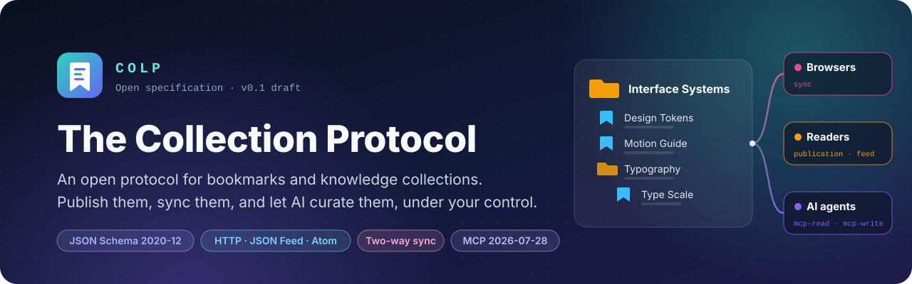
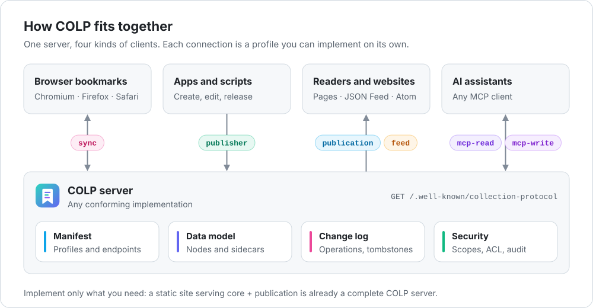
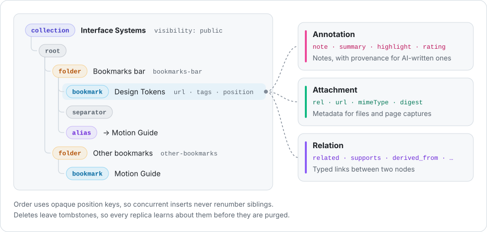
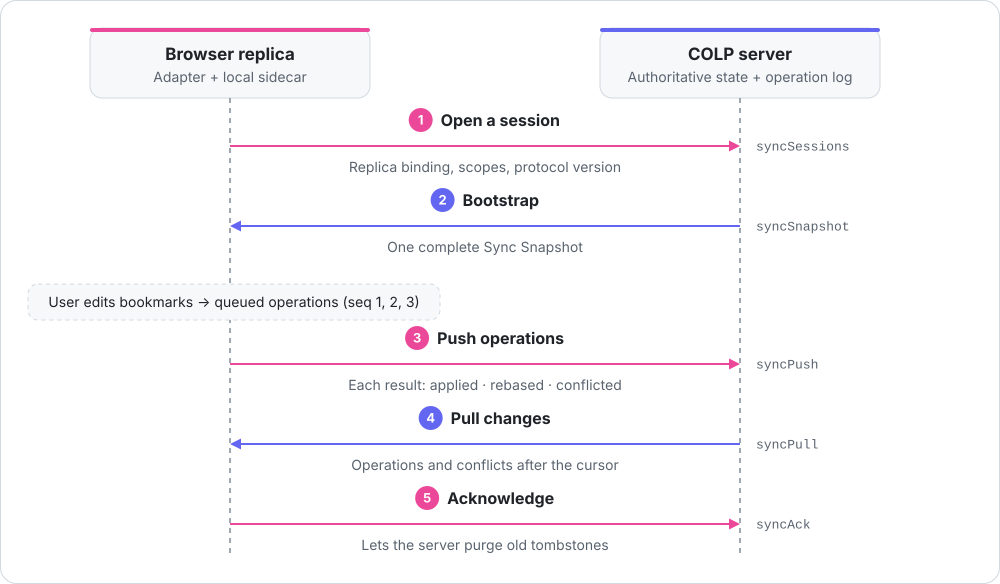
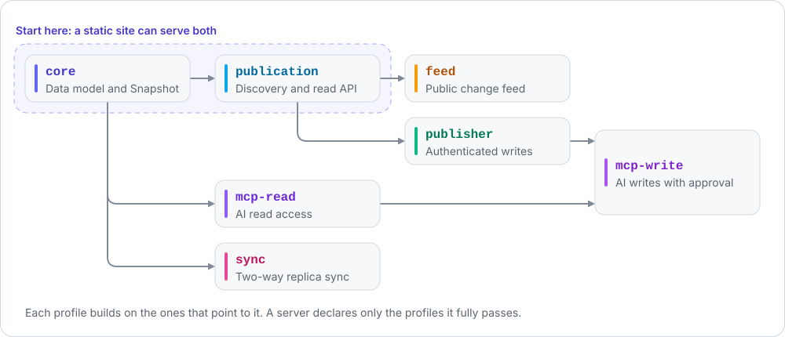

<p align="center">
  <picture>
    <source media="(prefers-color-scheme: dark)" srcset="docs/assets/banner.dark.svg">
    
  </picture>
</p>

<p align="center">
  <b>English</b> · <a href="README.zh-CN.md">简体中文</a> · <a href="README.ja.md">日本語</a>
</p>

<p align="center">
  <a href="https://github.com/WhitenWhiten/colp/actions/workflows/colp-ci.yml"></a>
  <a href="protocol/SPECIFICATION.md"></a>
  <a href="protocol/docs/05-mcp-profile.md"></a>
  <a href="packages/node"></a>
  <a href="LICENSE"></a>
</p>

Bookmarks are some of the most personal knowledge people keep, yet every browser stores them in its own format, sync is tied to one vendor, sharing a list means exporting HTML, and AI tools cannot safely touch them.

**The Collection Protocol (COLP)** is an open, HTTP-native protocol for bookmarks and curated knowledge collections:

- **One data model** for browser bookmark trees and knowledge collections, without loss for Chromium, Firefox, Safari, and Netscape bookmark HTML.
- **Publish** a collection the way you publish a blog: discovery, snapshots, JSON Feed, and Atom, with HTTP caching built in.
- **Sync** between browsers, apps, and servers through an operation log with revisions, conflicts, and tombstones.
- **Let AI help** through MCP resources and tools, with scopes, audit, and a plan → approve → commit flow for anything risky.
- **Private by default.** Syncing to a server is not publishing, and every token, key, and AI grant is scoped.

<p align="center">
  <picture>
    <source media="(prefers-color-scheme: dark)" srcset="docs/assets/architecture.dark.svg">
    
  </picture>
</p>

## Contents

- [How it works](#how-it-works)
- [Install from npm](#install-from-npm)
- [A quick look](#a-quick-look)
- [Try it](#try-it)
- [Find your way](#find-your-way)
- [Repository layout](#repository-layout)
- [Project status](#project-status)
- [Contributing](#contributing)

## How it works

This section is the short version. The [five-minute tour](protocol/README.md#colp-in-five-minutes) goes one level deeper, and the [glossary](protocol/GLOSSARY.md) explains every term.

### Data model

<p align="center">
  <picture>
    <source media="(prefers-color-scheme: dark)" srcset="docs/assets/data-model.dark.svg">
    
  </picture>
</p>

A **Collection** is an ordered tree of **Nodes** (`root`, `folder`, `bookmark`, `separator`, `alias`) that maps one-to-one onto a browser bookmark tree. Data that browsers cannot store lives next to the tree as **sidecars**: annotations (notes, summaries, highlights, ratings, with provenance for AI-written ones), attachments, and typed relations. Anything else goes into namespaced `extensions`, which servers preserve verbatim. See [01 Core data model](protocol/docs/01-core-data-model.md).

### Two-way sync

<p align="center">
  <picture>
    <source media="(prefers-color-scheme: dark)" srcset="docs/assets/sync-flow.dark.svg">
    
  </picture>
</p>

Replicas exchange **operations**, not whole trees. Each operation has a per-replica sequence number and the base revision it was made against, so the server can apply it, rebase it, or record a conflict, and a retried push never applies twice. Deletes leave tombstones until every active replica has acknowledged them. See [03 Sync](protocol/docs/03-sync.md) and [06 Browser mapping](protocol/docs/06-browser-mapping.md).

### Profiles

<p align="center">
  <picture>
    <source media="(prefers-color-scheme: dark)" srcset="docs/assets/profiles.dark.svg">
    
  </picture>
</p>

COLP is split into composable conformance profiles. A server declares in its Manifest only the profiles it fully passes, and clients discover everything else from there.

| Profile | What it adds | Spec |
|---|---|---|
| `core` | Objects, strict JSON Schema, semantic checks, complete Snapshot | [01](protocol/docs/01-core-data-model.md) |
| `publication` | Discovery, directory, metadata, paginated snapshots, ETags, Problem Details | [02](protocol/docs/02-http-publication-feed.md) |
| `feed` | Public change stream with cursors, JSON Feed, and Atom | [02](protocol/docs/02-http-publication-feed.md) |
| `publisher` | Authenticated writes with `If-Match`, idempotency keys, and releases | [08](protocol/docs/08-write-api.md) |
| `sync` | Sessions, push, pull, ack, conflicts, and tombstones | [03](protocol/docs/03-sync.md) |
| `mcp-read` | MCP resources and read-only tools | [05](protocol/docs/05-mcp-profile.md) |
| `mcp-write` | MCP write tools, scopes, audit, and plan / commit for high-risk changes | [05](protocol/docs/05-mcp-profile.md) |

## Install from npm

Requires **Node.js 22 or later**. Install the reference implementation in your application:

```bash
npm install @know-n/colp@0.1.0
```

The package includes TypeScript declarations and supports ESM and CommonJS. Save this example as `colp-demo.mjs` to try the package without a server:

```js
import { protocolVersion, supportedProfiles } from '@know-n/colp';
import { createUrlHash } from '@know-n/colp/semantic';

console.log(protocolVersion); // '0.1'
console.log(supportedProfiles); // core, publication, publisher, feed, sync, mcp-read, mcp-write
console.log(createUrlHash('https://example.com/'));
```

```bash
node colp-demo.mjs
```

Import APIs from their subpaths, such as `@know-n/colp/client`, `@know-n/colp/server`, or `@know-n/colp/semantic`. The package root exposes protocol metadata. See the [package README](packages/node/README.md) and [API guide](packages/node/docs/API.md) for validation, HTTP publication, Sync, and MCP examples.

To check a running COLP server without cloning this repository:

```bash
npx --yes --package=@know-n/colp-conformance@0.1.0 colp-conformance https://your-server.example
```

Replace the URL with your server's origin or Manifest URL. See the [runner README](packages/conformance/README.md) for options and programmatic usage. The packages are [@know-n/colp](https://www.npmjs.com/package/@know-n/colp) and [@know-n/colp-conformance](https://www.npmjs.com/package/@know-n/colp-conformance).

The `0.x` APIs may change between minor versions; pin a version when integrating.

## A quick look

Everything starts at a well-known URL. The Manifest tells a client which profiles a server supports and where every endpoint lives, so clients never guess paths:

```http
GET /.well-known/collection-protocol HTTP/1.1
Host: alice.example
Accept: application/vnd.collection-protocol.manifest+json
```

```jsonc
{
  "protocol": "https://know-n.com/colp/spec/0.1",
  "protocolVersions": ["0.1"],
  "serverUuid": "019b3c67-a03c-7f02-9c7e-1ee8d50a77de",
  "title": "Alice's Collections",
  "mounts": [{
    "id": "default",
    "baseUrl": "https://alice.example/collections/",
    "profiles": ["core", "publication", "publisher", "sync", "mcp-read", "mcp-write"],
    "endpoints": {
      "directory": "https://alice.example/collections",
      "collection": "https://alice.example/collections/c/{collectionId}",
      "snapshot": "https://alice.example/collections/c/{collectionId}/snapshot",
      "mcp": "https://alice.example/collections/-/mcp"
      // ... every endpoint the declared profiles require
    }
  }]
}
```

With the Node.js reference implementation, a client follows the Manifest and assembles a complete, validated Snapshot:

```ts
import { ColpClient } from '@know-n/colp/client';

const client = new ColpClient({
  manifestUrl: 'https://alice.example/.well-known/collection-protocol',
});

const manifest = await client.discover();
const snapshot = await client.getSnapshot('interface-systems');
console.log(manifest.title, snapshot.nodes.length);
```

The full example is [`protocol/examples/public-manifest.json`](protocol/examples/public-manifest.json); all 28 examples are validated in CI.

## Try it

You need Node.js 22 or later. From a fresh clone, build the reference package and run the example server's self-test. It starts a small `core + publication` server, reads everything back through the Manifest with `ColpClient`, and exits:

```bash
git clone https://github.com/WhitenWhiten/colp.git && cd colp
npm run install:package && npm run build
npm run example:publication -- --self-test
```

```text
Manifest:  Example Collections (core, publication)
Directory: 1 collection(s)
Metadata:  Interface Systems
Snapshot:  2 node(s), 1 annotation(s)
```

To poke at it with `curl`, start it without `--self-test` and stop it with Ctrl+C when you are done:

```bash
npm run example:publication
curl -i http://127.0.0.1:8080/.well-known/collection-protocol
```

The server is [one file](packages/node/examples/publication-server.mjs) built on `node:http`; it shows which parts belong to your application and which the package handles for you.

## Find your way

| You want to… | Start with |
|---|---|
| Understand how the protocol works | The [five-minute tour](protocol/README.md#colp-in-five-minutes), then the [glossary](protocol/GLOSSARY.md) |
| Read or validate COLP data from TypeScript or JavaScript | The [package README](packages/node/README.md) and the [API guide](packages/node/docs/API.md) |
| Serve COLP from your own server | The [Publication quickstart](packages/node/docs/PUBLICATION_QUICKSTART.md) and the [example server](packages/node/examples/publication-server.mjs) |
| Accept writes, sync browsers, or connect AI assistants | The [package guides](packages/node/docs/README.md#guides) |
| Implement COLP in another language | [Where to start](protocol/README.md#where-to-start) in the protocol README |
| Check that a server conforms | [`colp-conformance`](packages/conformance/README.md): `npx --yes --package=@know-n/colp-conformance@0.1.0 colp-conformance https://your-server.example` |
| Contribute | [CONTRIBUTING.md](CONTRIBUTING.md) |

The package is protocol logic without a server: it validates wire documents, decides what each request may do, and coordinates durable writes and sync exchanges, while your application supplies HTTP routes, authentication, and storage through small port interfaces.

## Repository layout

| Path | Contents |
|---|---|
| [`protocol/`](protocol/README.md) | The specification, its glossary, JSON Schemas, executable examples, and the requirement registry |
| [`packages/node/`](packages/node/README.md) | `@know-n/colp`, the reference implementation in TypeScript, with its tests and [guides](packages/node/docs/README.md) |
| [`packages/node/examples/`](packages/node/examples/publication-server.mjs) | A minimal read-only server you can run locally |
| [`packages/conformance/`](packages/conformance/README.md) | `colp-conformance`, a black-box test runner for any COLP server |
| [`docs/assets/`](docs/assets) | Banner and diagrams used by the READMEs |
| [`.github/workflows/colp-ci.yml`](.github/workflows/colp-ci.yml) | CI: protocol checks, example validation, type checks, tests, and the evidence check |

Common commands, from the repository root:

```bash
npm test                                   # the package's test suite
npm run check                              # every gate CI runs for the package
npm run conformance -- <server-url>        # test a live server (run `npm --prefix packages/conformance ci` once first)
cd protocol && python scripts/validate_examples.py   # validate the protocol examples (Python 3, see protocol/README.md)
```

## Project status

- **Specification:** `0.1-draft`. The 0.1 wire contract is closed: every DTO has a stable `$defs` name. Version 0.2 adds authoritative pull effects to Sync.
- **Node.js package:** implements all seven profiles. Every MUST and MUST NOT requirement maps to tests, as listed in [TRACEABILITY.md](packages/node/docs/TRACEABILITY.md). The npm package is `@know-n/colp`, starting at version `0.1.0`.
- **Conformance runner:** covers anonymous `core + publication` reads. Authenticated reads and the other profiles are next.
- **Not included:** a production server, a database adapter, or browser extensions. These belong to applications built on the package; the example server above shows the shape of one.

## Contributing

Issues and pull requests are welcome, and questions and early ideas go to [Discussions](https://github.com/WhitenWhiten/colp/discussions). Read [CONTRIBUTING.md](CONTRIBUTING.md) first; protocol changes should update the spec, schema, examples, and requirement registry together. [GOVERNANCE.md](GOVERNANCE.md) explains how changes are decided, and [ROADMAP.md](ROADMAP.md) lists what comes next. Report vulnerabilities privately as described in [SECURITY.md](SECURITY.md). Everyone taking part is expected to follow the [Code of Conduct](CODE_OF_CONDUCT.md).

## License

[Apache License 2.0](LICENSE).
