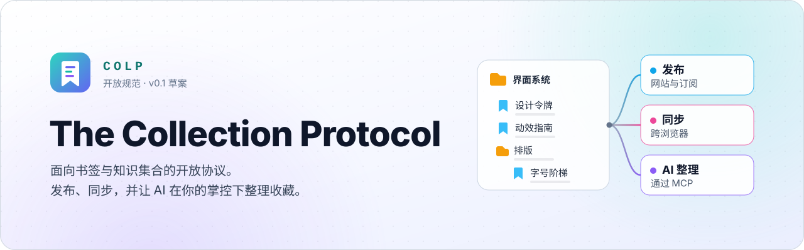
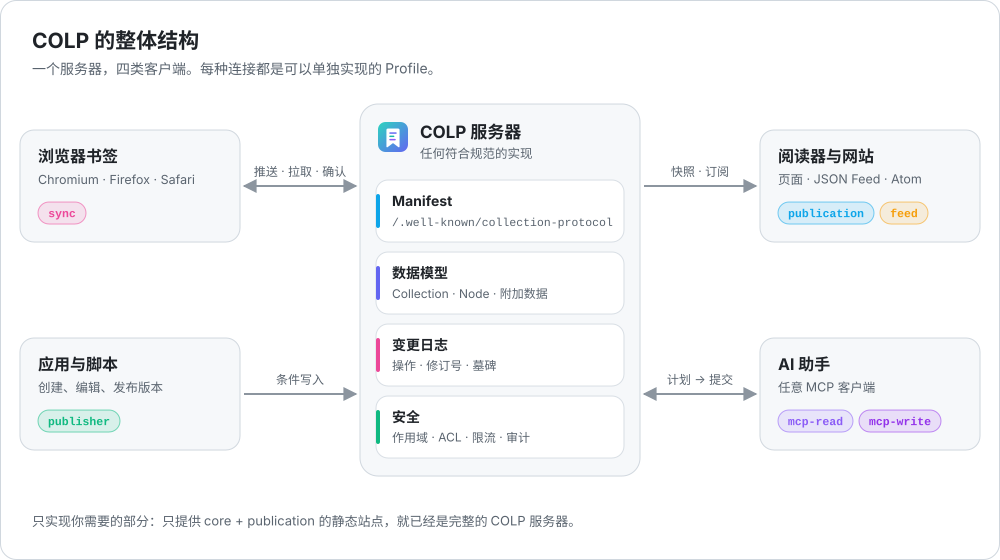
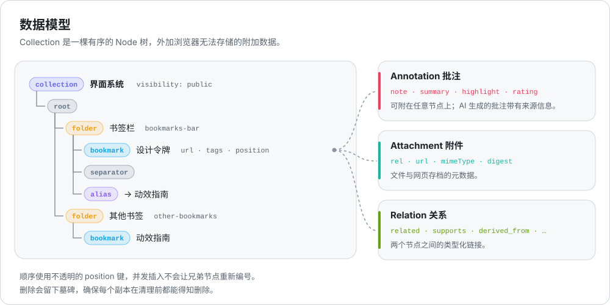
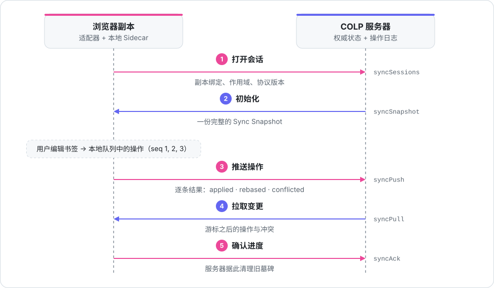
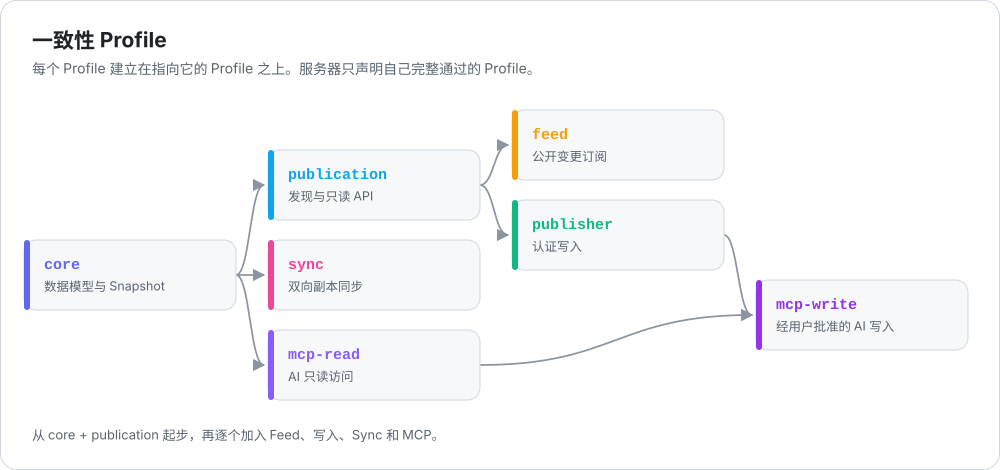

<p align="center">
  
</p>

<p align="center">
  <a href="README.md">English</a> · <b>简体中文</b>
</p>

<p align="center">
  <a href="https://github.com/WhitenWhiten/colp/actions/workflows/colp-ci.yml"></a>
  <a href="protocol/SPECIFICATION.md"></a>
  <a href="protocol/docs/05-mcp-profile.md"></a>
  <a href="packages/node"></a>
  <a href="LICENSE"></a>
</p>

书签是人们保存的最私人的知识之一。然而每个浏览器都用自己的格式存储书签，同步被绑定在单一厂商上，分享一个列表只能导出 HTML，AI 工具也无法安全地操作它们。

**The Collection Protocol（COLP）** 是一个面向书签与知识集合的开放协议，原生基于 HTTP：

- **统一的数据模型**：同时覆盖浏览器书签树与人工整理的知识集合，可以无损映射 Chromium、Firefox、Safari 与 Netscape 书签 HTML。
- **像博客一样发布**：发现、快照、JSON Feed 与 Atom，并内建 HTTP 缓存。
- **双向同步**：在浏览器、应用与服务器之间通过操作日志同步，具备修订号、冲突与墓碑。
- **让 AI 帮忙**：通过 MCP Resources 与 Tools 访问，带作用域与审计；任何高风险操作都走“计划 → 批准 → 提交”流程。
- **默认不公开**：同步到服务器不等于公开发布，每个令牌、密钥和 AI 授权都有明确的作用域。

<p align="center">
  
</p>

> 规范正文（[`protocol/`](protocol/README.zh-CN.md)）以英文为准，本页是中文导读。

## 目录

- [工作原理](#工作原理)
- [快速一览](#快速一览)
- [仓库结构](#仓库结构)
- [开始使用](#开始使用)
- [项目状态](#项目状态)
- [参与贡献](#参与贡献)

## 工作原理

### 数据模型

<p align="center">
  
</p>

**Collection** 是一棵有序的 **Node** 树（`root`、`folder`、`bookmark`、`separator`、`alias`），与浏览器书签树一一对应。浏览器无法存储的数据作为 **附加数据（sidecar）** 放在树旁边：批注（笔记、摘要、高亮、评分；AI 生成的批注带有来源信息）、附件，以及带类型的关系。其他数据放进带命名空间的 `extensions`，服务器会原样保留。详见 [01 核心数据模型](protocol/docs/01-core-data-model.md)。

### 双向同步

<p align="center">
  
</p>

副本之间交换的是 **操作**，而不是整棵树。每个操作都带有副本内的序号和它所基于的修订号，服务器可以直接应用、变基或记录冲突，重试的推送也不会被重复应用。删除会留下墓碑，直到所有活跃副本都确认过之后才清理。详见 [03 同步](protocol/docs/03-sync.md) 与 [06 浏览器映射](protocol/docs/06-browser-mapping.md)。

### Profile

<p align="center">
  
</p>

COLP 拆分为可组合的一致性 Profile。服务器只在 Manifest 中声明自己完整通过的 Profile，客户端从 Manifest 发现其余一切。

| Profile | 提供的能力 | 规范 |
|---|---|---|
| `core` | 核心对象、严格的 JSON Schema、语义校验、完整 Snapshot | [01](protocol/docs/01-core-data-model.md) |
| `publication` | 发现、目录、元信息、分页快照、ETag、Problem Details | [02](protocol/docs/02-http-publication-feed.md) |
| `feed` | 带游标的公开变更流、JSON Feed 与 Atom | [02](protocol/docs/02-http-publication-feed.md) |
| `publisher` | 带 `If-Match`、幂等键与版本发布的认证写入 | [08](protocol/docs/08-write-api.md) |
| `sync` | 会话、推送、拉取、确认、冲突与墓碑 | [03](protocol/docs/03-sync.md) |
| `mcp-read` | MCP Resources 与只读 Tools | [05](protocol/docs/05-mcp-profile.md) |
| `mcp-write` | MCP 写入 Tools、作用域、审计，以及高风险变更的计划 / 提交 | [05](protocol/docs/05-mcp-profile.md) |

## 快速一览

一切都从一个 well-known URL 开始。Manifest 告诉客户端服务器支持哪些 Profile、每个端点在哪里，客户端从不猜测路径：

```http
GET /.well-known/collection-protocol HTTP/1.1
Host: alice.example
Accept: application/vnd.collection-protocol.manifest+json
```

```jsonc
{
  "protocol": "https://collectionprotocol.org/spec/0.1",
  "protocolVersions": ["0.1"],
  "serverUuid": "019b3c67-a03c-7f02-9c7e-1ee8d50a77de",
  "title": "Alice's Collections",
  "mounts": [{
    "id": "default",
    "baseUrl": "https://alice.example/collections/",
    "profiles": ["core", "publication", "publisher", "sync", "mcp-read", "mcp-write"],
    "endpoints": {
      "directory": "https://alice.example/collections",
      "collection": "https://alice.example/collections/c/{collectionId}",
      "snapshot": "https://alice.example/collections/c/{collectionId}/snapshot",
      "mcp": "https://alice.example/collections/-/mcp"
      // ……以及所声明 Profile 需要的全部端点
    }
  }]
}
```

使用 Node.js 参考实现时，客户端跟随 Manifest，组装出一份完整且经过校验的 Snapshot：

```ts
import { ColpClient } from '@collection-protocol/node/client';

const client = new ColpClient({
  manifestUrl: 'https://alice.example/.well-known/collection-protocol',
});

const manifest = await client.discover();
const snapshot = await client.getSnapshot('interface-systems');
console.log(manifest.title, snapshot.nodes.length);
```

完整示例见 [`protocol/examples/public-manifest.json`](protocol/examples/public-manifest.json)；全部 28 个示例都在 CI 中校验。

## 仓库结构

| 路径 | 内容 |
|---|---|
| [`protocol/`](protocol/README.zh-CN.md) | 规范、JSON Schema、可执行示例与需求注册表 |
| [`packages/node/`](packages/node/README.md) | `@collection-protocol/node`：TypeScript 参考实现，以及测试与集成指南 |
| [`packages/node/examples/`](packages/node/examples/publication-server.mjs) | 可在本地运行的最小只读服务器 |
| [`packages/conformance/`](packages/conformance/README.md) | `colp-conformance`：适用于任何 COLP 服务器的黑盒测试工具 |
| [`docs/assets/`](docs/assets) | README 使用的横幅与示意图 |
| [`.github/workflows/colp-ci.yml`](.github/workflows/colp-ci.yml) | CI：协议检查、示例校验、类型检查、测试与证据检查 |

## 开始使用

**阅读协议。** 从 [协议导读](protocol/README.zh-CN.md) 开始，然后阅读 [00 实用 Profile](protocol/docs/00-practical-profile.md)，它说明了应该先实现什么。首个可互操作的服务器只需要 `core + publication`。

**校验示例**（Python 3）：

```bash
cd protocol
python -m venv .venv && . .venv/bin/activate
python -m pip install -r requirements-dev.txt
python scripts/validate_examples.py
```

**构建并测试 Node.js 包**（Node.js 22 或更高版本）：

```bash
npm run install:package
npm run build
npm test
```

**运行示例服务器。** 构建完成后，[`publication-server.mjs`](packages/node/examples/publication-server.mjs) 只用 `node:http` 就能在 `http://127.0.0.1:8080` 上以 `core + publication` Profile 提供一个 Collection：

```bash
npm run example:publication                 # 然后：curl -i http://127.0.0.1:8080/.well-known/collection-protocol
npm run example:publication -- --self-test  # 启动后用 ColpClient 读取全部内容，然后退出
```

**测试任意服务器。** [`colp-conformance`](packages/conformance/README.md) 会按照 `core + publication` 的需求检查一个在线服务器（可以用任何语言实现），并用需求 ID 标注每一项结果：

```bash
npm --prefix packages/conformance ci
npm run conformance -- https://your-server.example
```

这个包是不含服务器的协议逻辑：它校验 Wire 文档、判断每个请求能做什么，并协调持久化写入与同步交换；HTTP 路由、认证与存储由你的应用通过少量端口接口提供。建议从 [包 README](packages/node/README.md)、[Publication 快速上手](packages/node/docs/PUBLICATION_QUICKSTART.md) 与 [Publisher 快速上手](packages/node/docs/PUBLISHER_QUICKSTART.md) 开始。

## 项目状态

- **规范**：`0.1-draft`。0.1 的 Wire Contract 已收口，每个 DTO 都有稳定的 `$defs` 名称；0.2 为 Sync 增加了权威 Pull Effect。
- **Node.js 包**：实现了全部七个 Profile，每条 MUST 与 MUST NOT 需求都对应到测试，见 [TRACEABILITY.md](packages/node/docs/TRACEABILITY.md)。尚未发布到 npm。
- **一致性测试工具**：目前覆盖匿名的 `core + publication` 读取；带认证的读取与其他 Profile 将在后续加入。
- **不包含**：生产级服务器、数据库适配器或浏览器扩展。这些属于基于本包构建的应用；上面的示例服务器展示了这类应用的基本结构。

## 参与贡献

欢迎提交 Issue 与 Pull Request；问题与早期想法请发到 [Discussions](https://github.com/WhitenWhiten/colp/discussions)。请先阅读 [CONTRIBUTING.md](CONTRIBUTING.md)；协议变更需要同时更新规范、Schema、示例与需求注册表。[GOVERNANCE.md](GOVERNANCE.md) 说明了变更如何决定。安全漏洞请按 [SECURITY.md](SECURITY.md) 私下报告。所有参与者都应遵守 [行为准则](CODE_OF_CONDUCT.md)。

## 许可证

[Apache License 2.0](LICENSE)。
